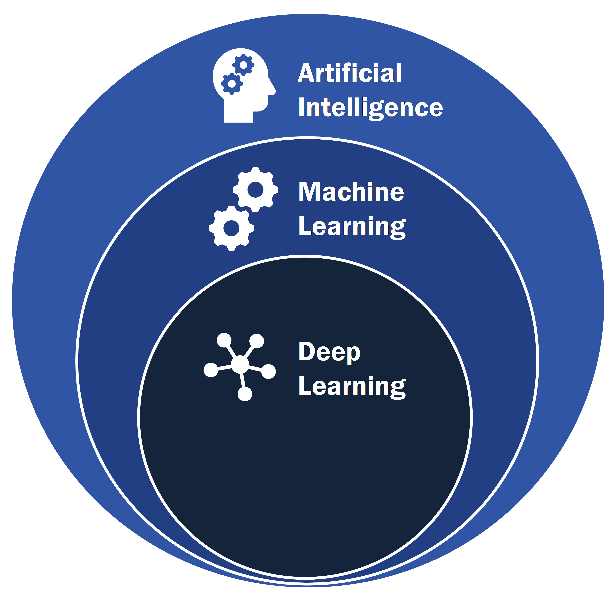
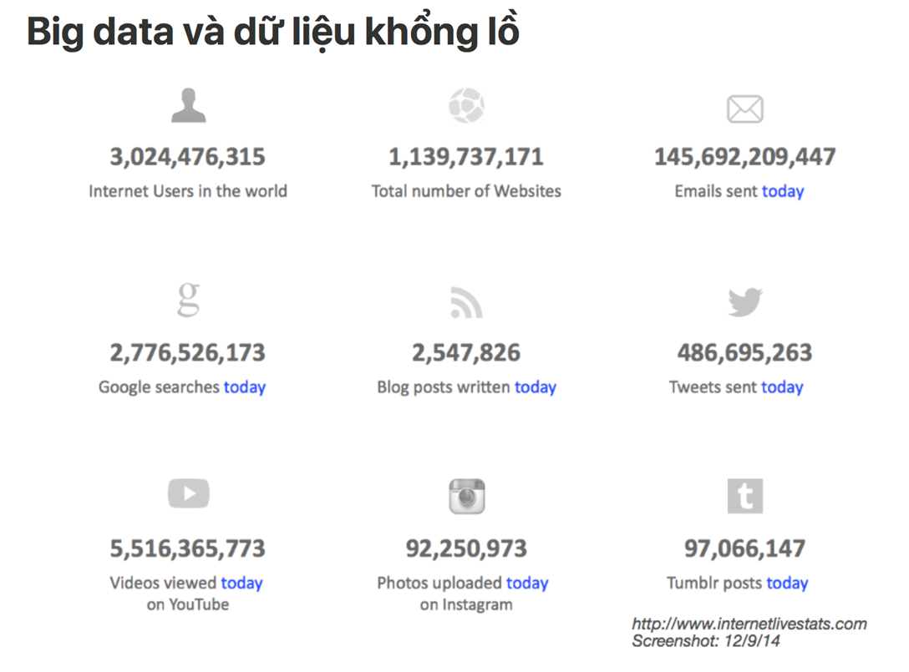
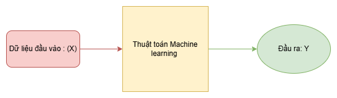
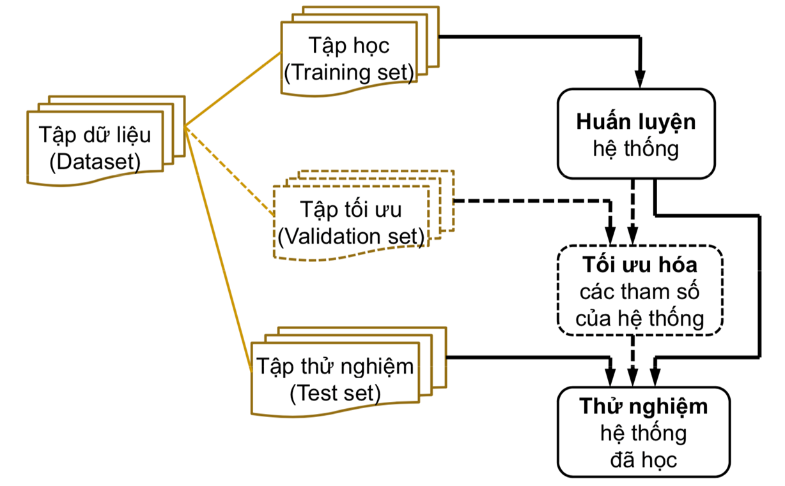
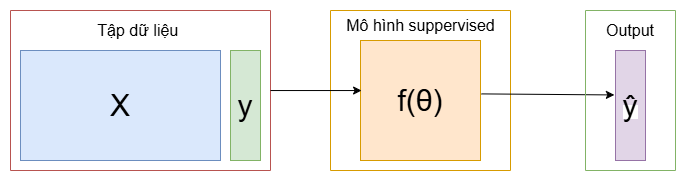
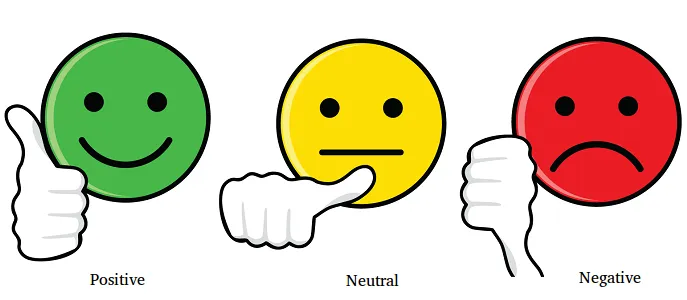
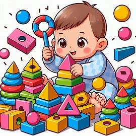

> Chào mừng các bạn đã đến với khóa Machine Learning đầu tiên của của AI Club 😍

# I. Giới thiệu

Thời điểm tôi viết những dòng này, các bạn có lẽ đã nghe đến chatGPT, trợ lý Siri của Apple…
 và chắc mình không cần giải thích khả năng ưu việt của nó nữa. Sự xuất hiện của những thứ trên 
 là nhờ vào (ML), một nhánh con của trí tuệ nhân tạo(AI). 
 “_Machine Learning là quá trình mà máy tính học hỏi từ bộ dữ liệu mà không cần phải được lập trình rõ ràng_”
[Học máy - machine learning: giải thích đơn giản dễ hiểu (itguru.vn)](https://itguru.vn/blog/machine-learning-hoc-may-don-gian-de-hieu/#:~:text=Machine%20Learning%20l%C3%A0%20m%E1%BB%99t%20l%C4%A9nh%20v%E1%BB%B1c%20con%20c%E1%BB%A7a,h%E1%BA%BFt%20c%C3%A1c%20ch%C6%B0%C6%A1ng%20tr%C3%ACnh%20AI%20%C4%91%C6%B0%E1%BB%A3c%20th%E1%BB%B1c%20hi%E1%BB%87n.).
Từ khái niệm trên ta có thể suy ra được rằng dữ liệu là cơ sở chính và sự xuất hiện của **Big data** 
góp phần cho sự phát triển mạnh mẽ của Trí Tuệ Nhân Tạo.

<figure style="text-align: center;">
  
  <figcaption><i>Hình 1. Sơ đồ tổng quát về AI</i></figcaption>
</figure>

Nếu cho rằng **Big data** như là một “_cách mạng công nghiệp của kỉ nguyên phần mềm_”
 thì không sai bởi nhu cầu chia sẻ thông tin của con người ngày nay trên internet thực
  sự rất lớn, bạn có thể xem những fact và ảnh bên dưới:

- Cứ mỗi 1 phút thì khoảng 500 giờ video được lên youtube [YouTube: hours of video uploaded every minute 2022 Statista](https://www.statista.com/statistics/259477/hours-of-video-uploaded-to-youtube-every-minute/)
- 3.5 tỷ lần search trên google mỗi ngày [Google Search Statistics - Internet Live Stats](https://www.internetlivestats.com/google-search-statistics/#:~:text=Google%20now%20processes%20over%2040%2C000%20search%20queries%20every,day%20and%201.2%20trillion%20searches%20per%20year%20worldwide.)

<figure style="text-align: center;">
  
  <figcaption><i>Hình 2. Sự lớn mạnh của BigData</i></figcaption>
</figure>

Vì sự lớn mạnh của dữ liệu. Ta cần một thứ để tận dụng sức mạnh của nó. Đó là **Machine Learning.**

# II. Vậy Machine Learning là gì?

## 1. Khái niệm cơ bản

Như đã đề cập ở trên cũng như nhìn về tên của của nó thì Machine Learning chính
là ta sẽ cho máy của mình “học”, “học” ở đây nghĩa là ta sẽ đưa cho máy một tập dữ liệu,
máy sẽ trả cho ta một kết quả ta mong muốn. Theo khái niệm của toán-lập trình, ta có thể hiểu
Machine Learning như là một hàm $f : x \rightarrow y$ hoặc $f(x) = y$, với hàm $\color{orange}{f(.)}$
là thuật toán ML có thể biến dữ liệu đầu vào: $\color{red}{x}$ thành đầu ra, mong muốn: $\color{green}{y.}$

<figure style="text-align: center;">
  
  <figcaption><i>Hình 3. Khái quát quá trình learning</i></figcaption>
</figure>

Thông thường hàm $\color{orange}{f(.)}$ được xác định qua một bộ tham số $w$ (một số tài liệu sẽ kí hiệu là $\theta$).
 Bộ tham số này thường sẽ được tìm thấy khi giải một bài toán tối ưu (optimization problem). 
 Quá trình tìm bộ số này sẽ gọi là “huấn luyện” của Machine Learning.

<figure style="text-align: center;">
  
  <figcaption><i>Hình 4. Quá trình huấn luyện</i></figcaption>
</figure>

Và tùy dạng toán Machine Learning sẽ có những cách “học” khác nhau nhưng chung quy loại cả quá trình sẽ có chia tập dữ liệu gốc ra thành 3 tập.

- Training Set (tập học - tập huấn luyện): Dùng để cập nhật tham số chính trong quá trình huấn luyện.
- Validation Set (Tập tối ưu): Dùng để cho biết hiệu suất của mô hình trong quá trình Training có tốt không.
- Test set (Tập thử nghiệm): Sau khi huấn luyện xong, đây là tập dữ liệu dùng để đánh giá độ hiểu quả của mô hình.

Thông thường trong quá trình huấn luyện sẽ có những thang đo để đánh giá. (Mình sẽ trình bày ở các bài sau).

## 2. Các phương thức học máy (dạng toán)

### 2.1 Supervised Learning (Học có giám sát)

Đây là thuật toán phổ biến nhất trong Machine Learning với đặc điểm là với mỗi điểm dữ liệu trong tập dữ liệu, ta sẽ có label(nhãn) tương ứng (data, label) - ($\color{blue}{X}$,$\color{green}{y}$). Khi đưa dữ liệu này vào thuật toán Suppervised Learning $\color{orange}{f_{\theta}(.)}$ ta sẽ nhận được giá trị dự đoán $\color{pink}{\hat{y}}$. Với mục tiêu rằng $\color{green}{y}$ $\approx$ $\color{pink}{\hat{y}}$

<figure style="text-align: center;">
  
  <figcaption><i>Hình 5. Quy trình học có giám sát</i></figcaption>
</figure>

$$
y_i \approx f_{\theta}(x_i) = \hat{y}_i, ~~ \forall i = 1, 2, \dots, N
$$

Giống như con người ta lúc nhỏ vậy. Nếu như ta được cha mẹ chỉ rằng “Đây là hình vuông” thì ta sẽ biết nó là hình vuông, “Đây là hình tam giác” thì đây sẽ là hình tam giác. Ở ví dụ này thì ta sẽ đóng vai bố mẹ, mô hình ML sẽ như là con của mình. Nhiệm vụ của ta là phải dạy cho con mình biết phân biệt các dạng hình học. (Nhưng con bạn có thể chưa học được ở lần đầu tiên nên bạn sẽ cần phải dạy cho nó nhiều lần nữa cơ 😆)

    
    

<figcaption style="text-align: center;"><i>Hình 6. Ảnh được sinh bởi Bing Image Creator 😁</i></figcaption>

 
Thuật toán Supervised Learning còn chia ra thêm hai dạng nhỏ hơn là Classification và Regression.

- **2.1.1 Classification (Phân loại)**

  Bài toán phân loại là nếu các nhãn của tập data được chia thành một số hữu hạn đếm được (số nguyên).
  Ví dụ: Cho một ảnh chó hoặc mèo, ta sẽ dự đoán đó là ảnh chó hay mèo; Phân loại cảm xúc bình luận rằng bình luận đó là tích cực, trung lập hay tiêu cực.
    <figure style="text-align: center;">
        `
        <figcaption><i>Hình 7. Phân loại cảm x`úc bình luận</i></figcaption>
    </figure>

- **2.1.2 Regression (Hồi quy)**

  Bài toán hồi quy thì khác các nhãn của tập dữ liệu này là một số thực vô hạn không đếm được.
  Ví dụ: Dự đoán giá nhà; chiều cao; cân nặng; giá cổ phiếu.

Nếu bạn có một bài tập rằng: cần phải dự đoán giới tính và chiều cao. Thì phần dự đoán giới tính sẽ là thuật toán **Classification**. Dự đoán chiều cao sẽ là **Regression.**

### 2.2 Unsupervised Learning (Học không giám sát)

Điểm đặc biệt của các bài toán Unsupervised Learning đó là dữ liệu của chúng ta sẽ không có nhãn. Tức là chỉ có $X$ chứ không có $y$.

Vì không có nhãn để trực tiếp dạy cho mô hình nên mô hình sẽ dựa vào cấu trúc của dữ liệu để thực hiện một việc nào đó như là phân cụm, giảm chiều dữ liệu, phân rã dữ liệu để lưu trữ, tìm mối tương quan giữa các dữ liệu…

Để tương ứng với ví dụ ở trên thì lần này mình sẽ lấy ví dụ rằng: Một đứa trẻ khi được đưa một đống đồ chơi, nó sẽ tự đống biết phải làm gì với nó, có thể xếp chồng lên nhau, chọn những món đồ giống nhau, thậm chỉ là có thể phá vỡ đồ chơi đó nữa 💀.

    
    

<figcaption style="text-align: center;"><i>Hình 8. Ví dụ về học bán giám sát </i></figcaption>

 
Như Supervised thì  Unsupervised  cũng chia thành 2 loại như:

- 2.2.1 Clustering (Phân cụm)
  Trích từ trang [machinelearningcoban.com](http://machinelearningcoban.com/):
  "_Một bài toán phân cụm toàn bộ dữ liệu $\mathcal{X}$ thành các nhóm nhỏ dựa trên sự liên quan giữa các dữ liệu trong mỗi nhóm_
  _Ví dụ: đưa cho một đứa trẻ rất nhiều mảnh ghép với các hình thù và màu sắc khác nhau, ví dụ tam giác, vuông, tròn với màu xanh và đỏ, sau đó yêu cầu trẻ phân chúng thành từng nhóm. Mặc dù không cho trẻ biết mảnh nào tương ứng với hình nào hoặc màu nào, nhiều khả năng chúng vẫn có thể phân loại các mảnh ghép theo màu hoặc hình dạng._”
- 2.2.2 Association
  Là bài toán khi ta muốn tìm ra được một quy luật từ nhiều dữ liệu cho trước.
  Tiêu biểu nhất trong thuật toán này là bài toán Recommendation System (RecSys). Giả sử có hai người A, B có sở thích giống nhau. Hệ thống sẽ gợi ý sản phẩm mà người A thích cho người B.
  Bài toán giảm chiều dữ liệu thì sẽ sử lại các thông tin quan trọng nhất và bỏ bớt thông tin ít quan trọng hơn dựa vào một ngưỡng (threshold) nào đó.

### 2.3 Semi-Supervised Learning (Học bán giám sát)

Đây là bài toán kết hợp hai dạng trên khi mà tập dữ liệu của chúng ta chỉ có một phần là được gán nhãn.

Ví dụ thường gặp nằm ở các bài toán thu thập dữ liệu. Data lớn nhưng chưa có người gán nhán.

### 2.4 Reinforcement Learning (Học tăng cường)

Đây là một cách học rất hay nhưng cũng khá khó bởi vì thay vì tối ưu như thông thường. Ta sẽ có thêm một hàm lợi ích. Mục đích của mô hình là đạt được lợi ích cao nhất. Quá trình hành động của mô hình được thiết lập ngẫu nhiên và ta cần có một hàm thưởng phạt để giúp mô hình học đúng với mục đích hơn.

Đây là một trong những kĩ thuật quan trọng trong Deep Learning nhưng sẽ không được đề cập ở khóa này (Maybe khóa deeplearning nha 😁).

# III. Tài liệu tham khảo

1. [https://machinelearningcoban.com/](https://machinelearningcoban.com/)
