> Lí do mà mình viết blog vì muốn chia sẻ kiến thức mà mình hiểu đén với mọi người 😁😁

## I. Giới thiệu

Vậy **Linear regression** là gì? Bản chất từ **Linear** (tuyến tính) xuất phát từ *linearis* trong tiếng Latinh, có nghĩa là *thứ gì đó liên quan hoặc tương tự đường thẳng.* Đây là một kỹ thuật phân tích dữ liệu sử dụng một hay nhiều biến độc lập X (data) để dự đoán biến phụ thuộc Y (label). Nói đơn giản dựa vào X ta sẽ đi tìm một đường thẳng (hoặc [siêu phẳng](https://en.wikipedia.org/wiki/Hyperplane)) có thể đi qua toàn bộ điểm dữ liệu với điều kiện rằng bộ dự liệu có độ tương quan lớn với nhau.

Số chiều của siêu phẳng mô hình mối quan hệ giữa các biến phụ thuộc vào số chiều của dữ liệu (tính cả nhãn). Có nghĩa là nếu dữ liệu bạn có là 2 chiều thì siêu phẳng biểu diễn mối quan hệ sẽ là một đường thẳng, Hai chiều thì sẽ là một mặt phẳng, Bốn chiều sẽ là một không gian ba chiều…

Như vậy nếu dữ liệu ta có $dim=n$ thì siêu phẳng biểu diễn mối quan hệ sẽ có $dim = n-1$

<div style="text-align: center;">
    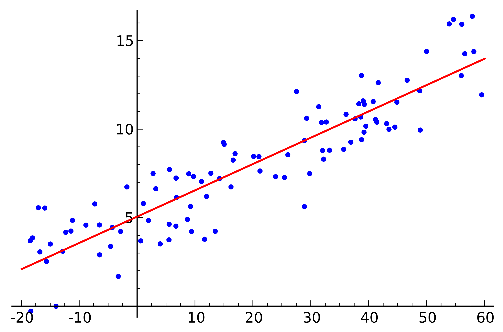
    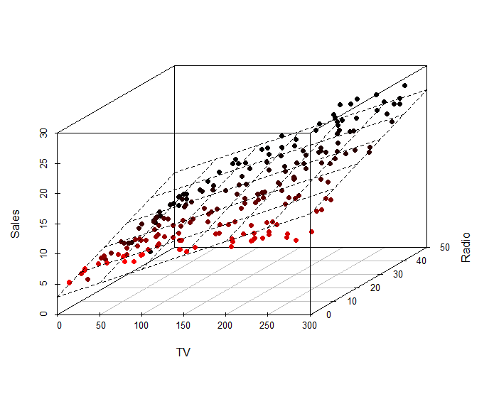
</div>
<figcaption style="text-align: center;"><i>Hình 1. Ví dụ về Linear regression trong không gian 1 và 2 chiều</i></figcaption>


Lấy một dữ liệu hai chiều làm ví dụ như sau: Bạn muốn đặt **XanhSM** (mình sẽ giả sử XanhSM có phương tiện với công nghệ tương lai, có thể đi với tốc độ ánh sáng 🤡) để đi từ IUH đến Gigamall với quảng đường $x =4km$ trong **8 phút** .Nhưng không may hôm nay hệ thống tính tiền bị lỗi và bạn không biết giá tiền như thế nào.

May thay bạn vẫn có thể truy cập vào lịch sử các chuyến đi của bạn và có dữ liệu như sau :


| Số Km(Km)  | Thời gian (Phút) | Số tiền phải trả (1000 VND) |
| --- | --- | --- |
| 12 | 24 | 60 |
| 2 | 4 | 13 |
| 6 | 25 | 20 |
| 7 | 13 | 35 |
| 9 | 17 | 40 |
| 15 | 10 | 125 |
| 1 | 3 | 10 |
| 20 | 40 | 90 |
| 18 | 4 | 300 |
| 50 | 90 | 202 |
| 31 | 62 | 128 |
| 14 | 28 | 72 |

Giả sử **số km** bạn đi và **số tiện bạn trả** phụ thuộc tuyến tính với nhau thì bạn có tìm ra được một hàm biểu thị mối quan hệ giữa hai đại lượng trên không? Nếu có thì hàm dự đoán sẽ như thế nào? Ở đây dữ liệu của mình sẽ đặt là $\color{teal}{\mathbf{x}} \color{white}{= [x_1,x_2] }$, với $x_1$ biểu diễn số km, $x_2$  biểu diễn số phút. 
Bạn có thể để ý rằng  nếu số km hoặc thời gian càng ngắn thì số tiền phải trả sẽ càng nhiều.

Ở bài trước mình đã nói về thuật toán Supervised Learning thì hàm mình cần biểu diễn sẽ có mục đích như sau: 

$$
\color{Lime}{y}\ \color{None}{\approx} \ \color{orange}{f(}\color{teal}{\mathbf{x}}\color{orange}{)} \ \color{None}{=} \ \color{hotpink}{\hat{y}}
$$

$$
\color{orange}{f(}\color{teal}{\mathbf{x}}\color{orange}{)} \color{Azure} = w_1 x_1 + w_2 x_2 +  w_0 ~~~~ (1)
$$

trong đó $\{w_1,w_2,w_0\}$ là bộ tham số cần tối ưu. $w_0$  (có thể kí hiệu bằng $\beta$) còn được gọi là bias. Bài toán Linear Regresion định nghĩa rằng ta phải tìm bộ tham số $\{w_1,w_2,w_0\}$ sao cho siêu phẳng $\color{orange}{f(}\color{teal}{\mathbf{x}}\color{orange}{)}$  xấp xỉ được $\color{Lime}{y}$ .

## II. Phân tích toán học.

### 2.1. Biểu diễn toán học.

Ở cấp ba có thể bạn sẽ biết phương trình biểu diễn một đường thẳng trên một hệ tọa độ $Oxy$  sẽ có dạng :  $ax + by + c = 0$ hay $y = ax + b$. Trong đó $a$  là độ dốc (slope) $b$ là tung độ (phòng trường hợp bạn quên, mình sẽ để một video siêu hay từ Vật Lý Chill [tại đây](https://youtu.be/mn4JSg1NzOs?si=kJz0E5NrYeb_IcCw))


<figure style="text-align: center;">
  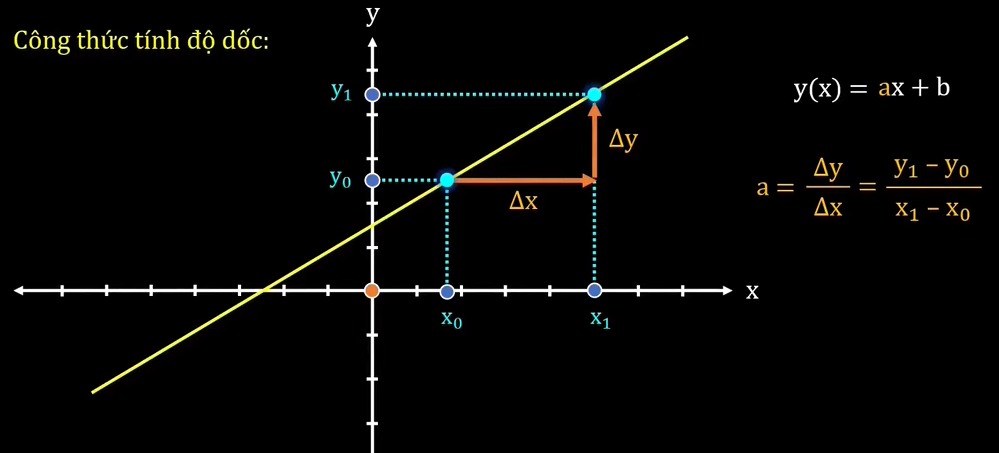
  <figcaption><i>Hình 2. Ảnh từ Video giải thích bản chất của Linear Function (<a href="https://youtu.be/mn4JSg1NzOs?si=kJz0E5NrYeb_IcCw">Vật Lý Chill</a>)</i></figcaption>
</figure>


Bản chất của Linear Regression là ta sẽ đi tìm bộ tham số sao cho siêu phẳng xấp xỉ được giá trị của các điểm dữ liệu. Và bạn sẽ thấy được $\{w_1,\cdots, w_n\}$ sẽ biểu diễn cho độ dốc của siêu phẳng, và $w_0$  hay $\beta$ sẽ biểu diễn cho độ dốc.

Quay lại với ví dụ ở trên, bây giờ ta sẽ đặt $\mathbf{w} = [w_0,w_1,w_2]^T$, $\color{teal}{\bar{\mathbf{x}} = [1,x_1,x_2] }$. Lúc này <span style="color:hotpink;">giá trị dự đoán</span> $\color{hotpink}{\hat{y}}$ sẽ là một tổ hợp tuyến tính  từ $\color{teal}{\bar{\mathbf{x}}}$ và $\mathbf{w}$

$$
\color{Lime}{y} \ \color{None}{ \approx}  \ \color{teal}{\mathbf{\bar{x}}} \color{None}{\mathbf{w}} = \color{hotpink}{\hat{y}}
$$

Và nếu bạn có thắc mắc rằng “Làm cách nào để biết bộ tham số nào là tốt?”.  Từ đây ta sẽ có khái niệm **Hàm mất mát.**

### 2.2. Hàm mất mát (loss function)

Hầu như mọi thuật toán Machine Learning cần có một phương thức để có thể đánh giá mô hình đó có tốt hay không, đó sẽ gọi là hàm mất mát,  Mục đích chính của hàm mất mát là đo lường sự khác biệt giữa <span style="color:hotpink;">giá trị dự đoán</span> của mô hình và <span style="color:lime;">giá trị thực tế</span> mà mô hình cần phải dự đoán. Từ đó, hàm mất mát giúp tối ưu hóa và cải thiện hiệu suất của mô hình.

Trong bài này mình sẽ giới thiệu cho mọi người hàm Mean Squared Error(MSE) với công thức như sau:

$$
\mathcal{L}(\mathbf{w}) = \frac{1}{2}\sum_{i=1}^N (\color{Lime}{y_i} \color{None} - \color{hotpink}{ \hat{y}}\color{None})^2 = \frac{1}{2}\sum_{i=1}^N (\color{Lime}{y_i} \color{None} - \color{teal}{\mathbf{\bar{x}}} \color{None}{\mathbf{w}})^2 ~~~~~(2) 
$$

*“Số $\frac{1}{2}$ là hằng số không ảnh hưởng gì đến kết quả, mà sẽ giúp cho đạo hàm (phần sau) trở nên đẹp hơn”*

Ta sẽ mong muốn rằng sự sai số giữa <span style="color:hotpink;">giá trị dự đoán</span> và <span style="color:lime;">giá trị thực tế</span> sẽ là nhỏ nhất. Đồng nghĩa với việc tìm hệ số $\mathbf{w}$ sao cho $\mathcal{L}(\mathbf{w})$ đạt giá trị nhỏ nhất. Và bộ tham số thỏa mãn điều kiện trên được gọi là nghiệm tối ưu của bài toán, ký hiệu là :

$$
\mathbf{w}^* = \arg\min_{\mathbf{w}} \mathcal{L}(\mathbf{w})
$$

Để quá trình giải nghiệm tối ưu dễ dàng hơn thì mình sẽ đặt $\color{Lime}{\mathbf{y} = [y_1; y_2; \dots; y_N]} \ \color{None}{\in \mathbb{R}^N }$ , là vector chứa toàn bộ <span style="color:lime;">giá trị thực tế</span> trong bộ data, $\color{teal}{\mathbf{\bar{X}} = [\mathbf{\bar{x}}_1; \mathbf{\bar{x}}_2; \dots; \mathbf{\bar{x}}_N ]} \ \color{None}{\in \mathbb{R}^{d \times N}}$
 là ma trận của toàn bộ dữ liệu với $d$  là số chiều của dữ liệu và $N$ là số lượng điểm dữ liệu. Khi này hàm mất mát sẽ được viết dưới dạng ma trận tổng quát đơn giản hơn.

$$
\mathcal{L}(\mathbf{w})= \frac{1}{2} \| \color{Lime}{\mathbf{y}} \color{None}{-} \color{teal}{ \mathbf{\bar{X}}} \color{None}{\mathbf{w} \|_2^2} ~~~(3)
$$

Đây là công thức bình phương khoảng cách Euclid  (Chuẩn Euclid, Norm 2). Từ đây ta có thể nó
i rằng MSE sẽ so sánh vector <span style="color:lime;">giá trị thực tế</span> và vector <span style="color:hotpink;">giá trị dự đoán</span> với nhau. Ngoài ra Norm 2  có thể khai triển ra như sau:  $\color{Coral}{\|z\|_2 = \sqrt{z^Tz}}$ .

### 2.3. Bổ sung về toán học

“*Ở phần này thì mình sẽ nói về các khái niệm toán mà bạn sẽ gặp nếu muốn hiểu sâu về quá trình mà một mô hình máy học sẽ tối ưu. Vậy nếu bạn không đam mê về toán hoặc không hiểu nổi thì hãy skip phần này nhé :D*”

Một bật mí nhỏ cho các bạn nếu đam mê về toán thì MSE là một dạng toàn phương ([Quadratics Forms](https://en.wikipedia.org/wiki/Quadratic_form)), đây là biểu diễn của phương trình bậc hai của không gian lớn hơn 1 chiều (tức là phương trình bậc hai thông thường cũng là một dạng toàn phương). Với biến là vector $\mathbf{x} = [x_1,x_2,...,x_n] \in \mathbb{R}^n$ thì phương trình tổng quát của dạng toàn phương như sau :  

$$
f(\mathbf{x})=\mathbf{x}^TA\mathbf{x} + b^T\mathbf{x} + c
$$

“Nhìn quen nhỉ, trông đâu khác gì $f(x) = ax^2 + bx +c$   đâu 😁“.

Và tương tự như hàm bậc 2 với đạo hàm $f(x)^{'} = 2ax +b$  thì đạo hàm bậc một tổng quát của dạng toàn phương sẽ là $f(\mathbf{x})^{'} = 2Ax + b$. (Có một bài viết mà blog này đã chia sẻ về đạo hạm, các bạn có thể tham khảo thêm tại đây).

Ở trong toán tối ưu thì sẽ có khái niệm gọi là “Bài toán tối ưu lồi”.  Dựa vào hàm của bạn là hàm lồi hay hàm lõm thì ta sẽ phải đi tìm điểm cực tiểu hay cực đại của chúng.

<div style="text-align: center;">
    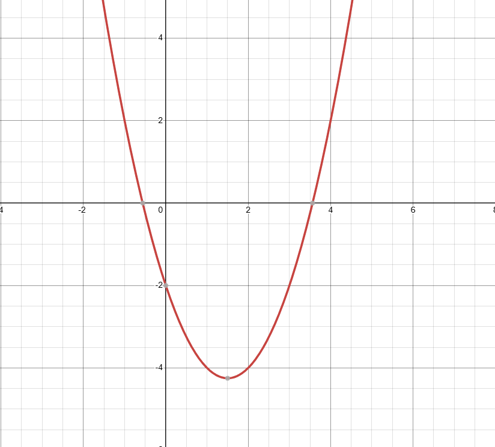
    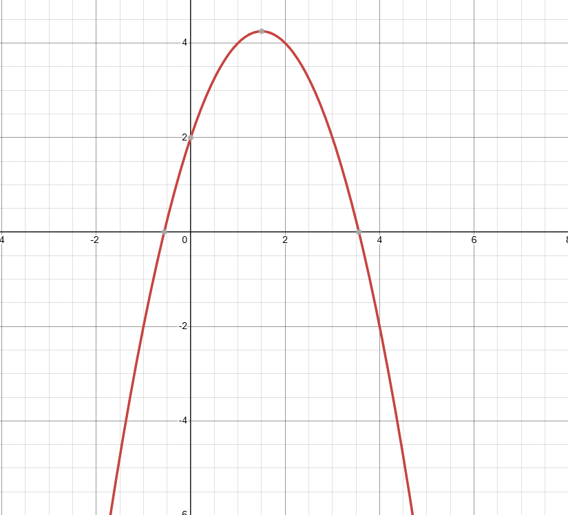
</div>
<figcaption style="text-align: center;"><i>Hình 3. Ví dụ về hàm lồi (bên trái) và hàm lõm (bên phải)</i></figcaption>

Vậy thì hàm có dạng toàn phương là hàm lồi (convex function) hay hàm lõm (concave function)? Ta chưa trả lời được nhưng đơn giản lắm, bạn có để ý thấy ma trận $A \in \mathbb{R}^{n \times n}$ ở trong hàm toàn phương không, cứ coi nó là hệ số góc đấy.  Ma trận đó thường là một ma trận đối xứng. Nhưng đối với không gian lớn hơn 1 chiều thì sẽ có khái niệm ***nửa xác định dương, xác định dương, nửa xác định âm, xác định âm**.*

- Nếu $A$  là một mà trận (nửa) xác định dương thì $f(\mathbf{x})$ là một hàm lồi.
- Nếu $A$  là một mà trận (nửa) xác định âm thì $f(\mathbf{x})$ là một hàm lõm.

*“Ủa vậy sao mà biết ma trận mình đang xét là ở dạng nào?”.*  Đơn giản giản là ta chứng minh các bất đẳng thức sau với ma trận đang xét (trong trường hợp này là $A$) , $\forall \ z \in \mathbb{R}^n$

- Ma trận nửa xác định dương nếu : $z^TAz \geq 0$
- Ma trận xác định dương nếu :        $z^TAz > 0$
- Ma trận nửa xác định âm nếu :       $z^TAz \leq 0$
- Ma trận xác định âm nếu :              $z^TAz < 0$

Mà thường thì chúng ta ít xét trường hợp này lắm. có một mẹo là : “Với một ma trận cấp bất kì thì nếu nó nhân với hoán vị của chính nó thì sẽ có được một ma trận mới là ma trận đối xứng nửa xác định dương” Biểu diễn toán học : Với $U \in \mathbb{R}^{n \times m}$ thì  $UU^T \geq 0$   và $U^TU \geq 0$.

Well… Chắc là đủ mắm muối rồi, cùng nhảy vào kiếm nghiệm tối ưu nhé 🫣

### 2.4. Nghiệm của bài toán Linear Regression

Như đã đề cập ở trên thì mình có nói là MSE là một hàm lồi (mình sẽ nói tại sao nó lồi sau) vậy nên nó sẽ có một giá trị tối ưu cho hàm MSE là nhỏ nhất. Vậy như ở cấp ba, cách để tìm giá trị tối ưu này đó là đạo hàm lên và giải phương trình đạo hàm bằng 0. Nhưng mà làm cách nào để đạo hàm được hàm đó, nếu đã đọc phần 3 thì mình sẽ chứng minh cho các bạn thấy MSE là dạng toàn phương và là hàm lồi nhé.

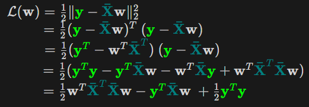
<!-- $\begin{matrix}
\mathcal{L}(\mathbf{w})= \frac{1}{2} \| \color{Lime}{\mathbf{y}} \color{None}{-} \color{teal}{ \mathbf{\bar{X}}} \color{None}{\mathbf{w} \|_2^2} \\~~~~~~~~~~~~~~~~~~~~~~~~~~= \frac{1}{2}(\color{Lime}{\mathbf{y}} \color{None}{-} \color{teal}{ \mathbf{\bar{X}}} \color{None}{\mathbf{w})^T \ (}\color{Lime}{\mathbf{y}} \color{None}{-} \color{teal}{ \mathbf{\bar{X}}} \color{None}{\mathbf{w}})\\~~~~~~~~~~~~~~~~~~~~~~~~~~~~~~~~~~=\frac{1}{2}(\color{Lime}{\mathbf{y}}^T \color{None}- \color{None}\mathbf{w}^T\color{teal}{\mathbf{\bar{X}}}^T \color{None})\ (\color{Lime}{\mathbf{y}} \color{None}- \color{teal}{\mathbf{\bar{X}}} \color{None}\mathbf{w}) \\~~~~~~~~~~~~~~~~~~~~~~~~~~~~~~~~~~~~~~~~~~~~~~~~~~~~~~~~~~=\frac{1}{2}(\color{Lime}{\mathbf{y}}^T\color{Lime}{\mathbf{y}}\color{None} - \color{Lime}{\mathbf{y}}^T \color{teal}{\mathbf{\bar{X}}} \color{None}\mathbf{w} - \mathbf{w}^T \color{teal}{\mathbf{\bar{X}}}\color{Lime}{\mathbf{y}} \color{None}+ \mathbf{w}^T \color{teal}{\mathbf{\bar{X}}}^T\color{teal}{\mathbf{\bar{X}}}\color{None}\mathbf{w})\\~~~~~~~~~~~~~~~~~~~~~~~~~~~~~~~~~~~~~~~~~~=\frac{1}{2}\color{None} \mathbf{w}^T \color{teal}{\mathbf{\bar{X}}}^T\color{teal}{\mathbf{\bar{X}}}\color{None}\mathbf{w} - \color{Lime}{\mathbf{y}}^T \color{teal}{\mathbf{\bar{X}}} \color{None}\mathbf{w} \ +\frac{1}{2} \color{Lime}{\mathbf{y}}^T\color{Lime}{\mathbf{y}}
\end{matrix}$ -->

Vậy ta đã nhìn ra được dạng toàn phương của MSE với ma trận $A$  tương ứng là $\color{teal}{\mathbf{\bar{X}}}^T\color{teal}{\mathbf{\bar{X}}}$ 

Mà $\color{teal}{\mathbf{\bar{X}}}^T\color{teal}{\mathbf{\bar{X}}}$ là một ma trận đối xứng nửa xác định dương nên hàm MSE là một hàm lồi (đpcm :v). 

<div style="text-align: center;">
    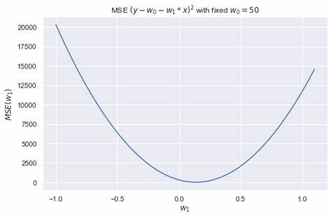
    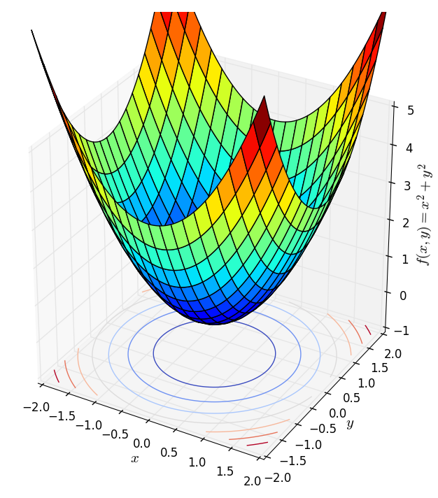
</div>
<figcaption style="text-align: center;"><i>Hình 4. Ví dụ về hàm MSE trong không gian 1 và 2 chiều</i></figcaption>

Và áp dụng công thức đạo hàm bậc một $(\frac{\partial{\mathcal{L}(\mathbf{w})}}{\partial{\mathbf{w}}} = \color{teal}{\mathbf{\bar{X}}}^T\color{teal}{\mathbf{\bar{X}}}\color{None}\mathbf{w} - \color{teal}{\mathbf{\bar{X}}}^T\color{Lime}{\mathbf{y}} \color{None})$ và giải phương trình đạo hàm đó bằng không ta có  .

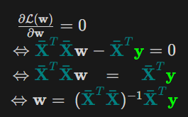
<!-- $\begin{matrix}
\frac{\partial{\mathcal{L}(\mathbf{w})}}{\partial{\mathbf{w}}} = 0~~~~~~~~~~~~~~~~~~~~ \\\Leftrightarrow \color{teal}{\mathbf{\bar{X}}}^T\color{teal}{\mathbf{\bar{X}}}\color{None}\mathbf{w} - \color{teal}{\mathbf{\bar{X}}}^T\color{Lime}{\mathbf{y}} \color{None} = 0 \\\Leftrightarrow \color{teal}{\mathbf{\bar{X}}}^T\color{teal}{\mathbf{\bar{X}}}\color{None}\mathbf{w}  ~~~=~~~~  \color{teal}{\mathbf{\bar{X}}}^T\color{Lime}{\mathbf{y}} \color{None} \\\Leftrightarrow \color{None}\mathbf{w} =~  (\color{teal}{\mathbf{\bar{X}}}^T\color{teal}{\mathbf{\bar{X}}}\color{None})^{-1}\color{teal}{\mathbf{\bar{X}}}^{T}\color{Lime}{\mathbf{y}} \color{None}
\end{matrix}$ -->

Trong trường hợp $\color{teal}{\mathbf{\bar{X}}}^T\color{teal}{\mathbf{\bar{X}}}$ không khả nghịch, ta sẽ có một khái niệm gọi là [Giả Nghịch Đảo](https://vi.wikipedia.org/wiki/Gi%E1%BA%A3_ngh%E1%BB%8Bch_%C4%91%E1%BA%A3o_Moore%E2%80%93Penrose). Vậy trường hợp này, nghiệm tối ưu của bạn toán linear regression sẽ có dạng:

$$
\color{None}{\mathbf{w}^* =~  (}\color{teal}{\mathbf{\bar{X}}}^T\color{teal}{\mathbf{\bar{X}}}\color{None}{)^{\dagger}} \color{teal}{\mathbf{\bar{X}}}^{T}\color{Lime}{\mathbf{y}} 
$$

**LƯU Ý :** Trong tất cả các thuật toán Machine Learning thì chỉ duy nhất Linear Regression có công thức giải nghiệm tối ưu (vì giải phương tình đạo hàm bằng không dường nhi bất khả thi). Mà với trường hợp bộ dữ liệu quá lớn, máy tính sẽ không có đủ tài nguyên để tính toán nghịch đảo của ma trận trên. 

Vậy thì họ xài gì để tìm nghiệm tối ưu? Câu trả lời đó chính là **Gradient Descent.** 

### 2.5. Gradient Descent cho Linear Regression

“*Phần này thì mình sẽ chỉ nói khái niệm đơn giản cho các bạn hiểu thôi, nội dung đầy đủ và chi tiết có lẽ sẽ nằm ở các phần khác.”*

Từ quan sát như sau: Nếu bạn đứng trên một thung lũng và thả một viên bi vào đó thì  nó sẽ tự lăn tới điểm thấp nhất trong thung lũng ấy. Ý tưởng của Gradient Descent là vậy.

Với một hàm mất mát là hàm lồi, ta sẽ bắt đầu khởi tạo bộ tham số ở vị trí ngẫu nhiên, bộ tham số này sẽ từ từ tiến đến giá trị tối ưu mà ta cần tìm.

<figure style="text-align: center;">
  
  <figcaption><i>Hình 5. Ví dụ về gradient descent (Nguồn : <a href="https://machinelearningcoban.com/">machinelearingcoban</a>)</i></figcaption>
</figure>


Với quan sát ấy, họ dựa vào khái niệm Gradient(có thể coi đây là đạo hàm cấp 1) nói ngắn gọn: Đối với hàm lồi thì ở phía bên trái của nghiệm tối ưu sẽ có đạo hàm bằng âm, các điểm bên phải sẽ có đạo hàm dương. Hàm lõm thì ngược lại. 

<figure style="text-align: center;">
  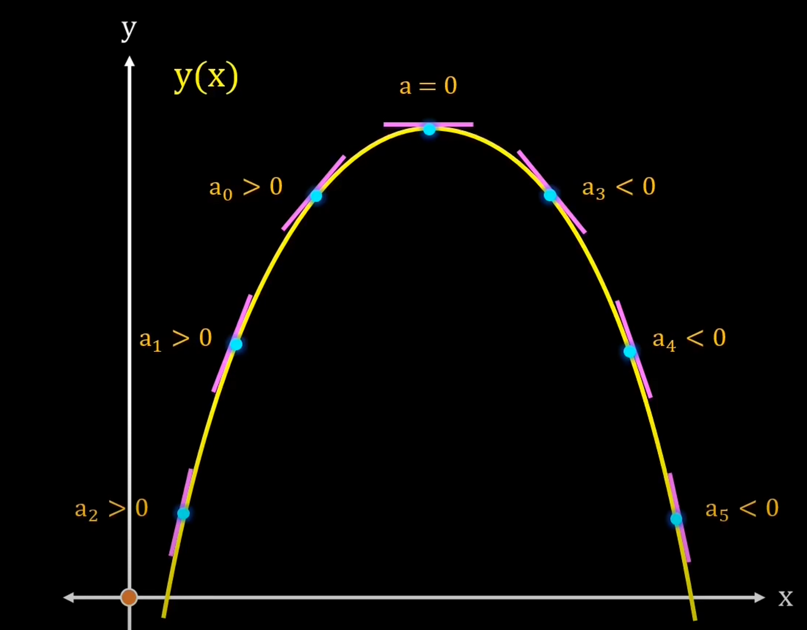
  <figcaption><i>Hình 6. Độ dốc của một hàm lõm </i></figcaption>
</figure>
 

Vậy công thức của Gradient Descent như sau : 

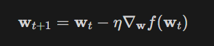

Giải thích sơ qua thì dựa vào vị trí bộ tham số hiện tại thì bộ tham số tiếp theo sẽ tiến gần tới tới điểm tối ưu $\mathbf{w}^*$ với khoảng cách là $\eta$  lần giá trị đạo hàm ở thời điểm hiện tại.

Với $\eta$  là số dương gọi là *Learning rate* biểu diễn tốc độ học. Dấu  trừ thể hiện việc ta sẽ đi ngược với đạo hàm (Đây là lý do nó có tên Gradient Descent).

Có một lưu ý nhỏ là ta cần phải lựa chọn $\eta$  một cách hợp lí thì nếu quá nhỏ thì nó sẽ hội tụ rất lâu (đi đến điểm tối ưu rất chậm), còn nếu quá lớn thì có thể sẽ phân kỳ (không chạm được tới điểm tối ưu) tức là sẽ bật qua bật lại 2 bên điểm tối ưu.

<div style="text-align: center;">
    <figure style="display: inline-block;">
        
        <figcaption><i>Hình 7. Hội tụ chậm khi eta thấp </i></figcaption>
    </figure>
    <figure style="display: inline-block;">
        
        <figcaption><i>Hình 8. Phân kỳ khi eta lớn </i></figcaption>
    </figure>
</div>

Vậy làm sao để chọn $\eta$ hợp lý. Câu trả lời thường sẽ là không có cách chọn sao cho hợp lý mà bạn sẽ phải tự thực nghiệm để tìm ra $\eta$ hợp lý nhất cho bài toán của mình.

## III. Thực Hành

Quay lại với ví dụ **XanhSM** ở đầu bài nhé. Dữ liệu của mình có  số chiều là 3 nên mình sẽ sẽ tìm một mặt phẳng (2 chiều) có thể đi qua hết các điểm dữ liệu này. 

Mình sẽ đưa kết quả từ nhưng đoạn code, sẽ  sử dụng plotly để biểu diễn đồ thị 3 chiều

```python
import numpy as np
import plotly.graph_objects as go
```

### 3.1 Hiển thị dữ liệu:

Đầu tiên sẽ nhập dữ liệu và vẽ theo tọa độ xyz.

```python
X = np.array([[12,2,6,7,9,15,1,20,18,50,31,14],
              [24,4,25,13,17,10, 3,40,4,90,62,28]]).T
y = np.array([60,13,20,36,40,126,10,90,300,202,128,72]).reshape(-1,1)

fig = go.Figure(data=[go.Scatter3d(
    x=X[:,0],
    y=X[:,1],
    z=y.ravel(),
    mode='markers',
    marker=dict(
        size=8,
        color=y.ravel(),               
        colorscale='Viridis',   
        opacity=0.8
    )
)])

fig.update_layout(
    scene = dict(
        xaxis_title='Số Km',
        yaxis_title='Thời gian',
        zaxis_title='Giá tiền'
    ),
    margin=dict(l=0, r=0, b=0, t=0)
)
fig.show()
```

<figure style="text-align: center;">
    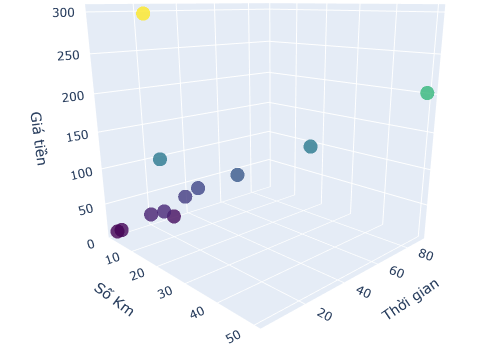
    <figcaption><i>Hình 9. Trực quan dữ liệu </i></figcaption>
</figure>

### 3.2 Giải bằng phương pháp Least Square

Đầu tiên sẽ áp dụng công thức Least Square để giải nghiệm.

```python
from numpy import linalg as LA

one = np.ones((X.shape[0], 1))
Xbar = np.concatenate((one,X), axis = 1)
# ap dụng cong thuc tìm nghiem:
result_least_square = LA.pinv(Xbar.T @ Xbar) @ Xbar.T @ y
print("w0 = ", result_least_square[0])
print("w1 = ", result_least_square[1])
print("w2 = ", result_least_square[2])
```

Output :

`w0 =  [25.60877573] 
w1 =  [13.37537191] 
w2 =  [-5.26484098]`

<div style="text-align: center;">
    
    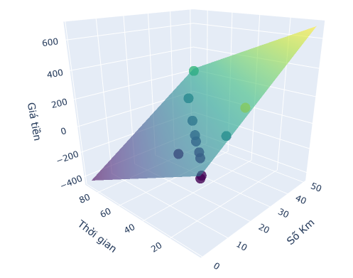
</div>
<figcaption style="text-align: center;"><i>Hình 10. Biểu diễn mặt phẳng trong từ nghiệm vừa tìm được</i></figcaption>

### 3.3 Giải bằng phương pháp Gradient Descent

```python
class LinearRegression: 
    def __init__(self, learning_rate=0.05, #learning rate
							      iterations=600, # epoch
							      tolerance=1e-3, # eps
							       clip_value=1.0) # clip to ignore gradient Explode:
        self.learning_rate = learning_rate
        self.iterations = iterations
        self.tolerance = tolerance
        self.clip_value = clip_value
        self.weights, self.bias = self._initialize_parameters()

    def _initialize_parameters(self):
    '''
    Init Param from zeros
    '''
        weights = np.zeros((X.shape[1], 1))
        bias = 0
        return weights, bias

    def _compute_cost(self, y, y_hat):
		    """
		    MSE from scratch
		    """
        m = len(y)
        cost = (1 / (2 * m)) * np.sum((y_hat - y) ** 2)
        return cost

    def _compute_gradients(self, X, y, y_hat):
		    """
		    calculate gradient of MSE
		    """
        m = len(y)
        dw = (1 / m) * np.dot(X.T, (y_hat - y))
        db = (1 / m) * np.sum(y_hat - y)
        return dw, db

    def _clip_gradients(self, dw, db):
		    """
		    use to avoid gradient exploxe
			  """
        dw = np.clip(dw, -self.clip_value, self.clip_value)
        db = np.clip(db, -self.clip_value, self.clip_value)
        return dw, db

    def _update_parameters(self, dw, db):
		    """
			    gradient update
		    """
        self.weights = self.weights - self.learning_rate * dw
        self.bias = self.bias - self.learning_rate * db

    def train(self, X, y):
        for i in range(self.iterations):
            y_hat = np.dot(X, self.weights) + self.bias
            cost = self._compute_cost(y, y_hat)
            dw, db = self._compute_gradients(X, y, y_hat)
            dw, db = self._clip_gradients(dw, db)
            if np.linalg.norm(dw)/len(dw) < self.tolerance:
                print(f"Convergence reached at iteration {i}")
                break
            self._update_parameters(dw, db)
            if i % 50==0:
                print(f"Iteration {i}, cost: {cost}")

    def predict(self, X):
        return np.dot(X, self.weights) + self.bias

model = LinearRegression()
model.train(X, y)

print("Nghiệm tìm bởi Gradient Descent")
print("w0 = ", model.bias)
print("w1 = ", model.weights[0][0])
print("w2 = ", model.weights[1][0])
```

`w0 =  23.548239494777462 
w1 =  13.220760543795164 
w2 =  -5.147517304599516`

### 3.4  So sánh kết quả với Sklearn

```python
from sklearn.linear_model import LinearRegression
from sklearn.metrics import mean_squared_error

model_sk = LinearRegression()
model_sk.fit(X, y)

predictions = model_sk.predict(X)
#
mse = mean_squared_error(y, predictions)
print(f"Mean Squared Error: {mse}")

print(f"w0 = {model_sk.intercept_[0]}")
print(f"w1 = {model_sk.coef_[0][0]}")
print(f"w2 = {model_sk.coef_[0][1]}")
```

`
 w0 = 25.608775733107606 
 w1 = 13.375371913472891 
 w2 = -5.26484097746805`

Nhận thấy rằng nghiệm của Sklearn và phương pháp LeastSquare là trùng khớp với nhau, Gradient descent sẽ cho kết quả tốt nhưng sẽ tốt hơn nếu có một kỹ thuật training hiệu quả hơn (khum chỉ đâu).

## IV. Kết luận

Cảm ơn các bạn đã đọc tới những dòng cuối của bài viết này, ở bài tiếp theo chúng ta sẽ qua thuật toán phân loại họ hàng với Linear Regression nhé.

Ngoài ra còn có những khái niệm mà bạn sẽ gặp trong quá tình training một thuật toán ML như là [Vanishing gradient và Exploding gradient](https://en.wikipedia.org/wiki/Vanishing_gradient_problem). Nhưng vì nội dung quá dài nên mình xin phép để dành trong một bài khác nhé.

**TÀI LIỆU THAM KHẢO :**
[Machine Learning cơ bản (machinelearningcoban.com)](https://machinelearningcoban.com/)