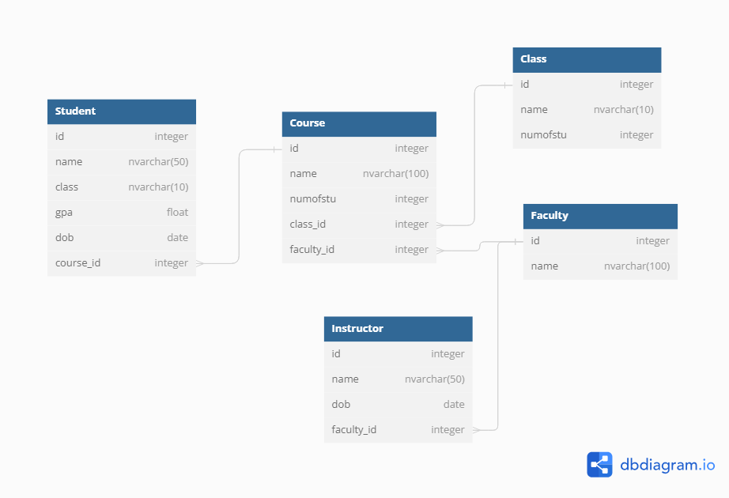
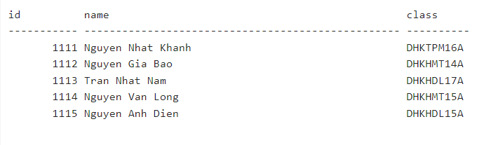
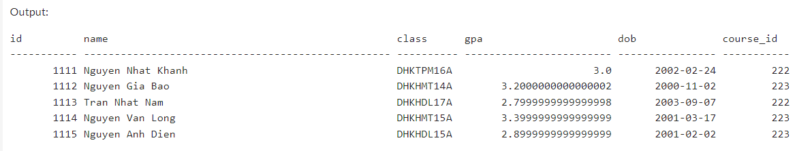
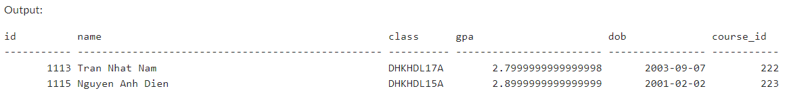
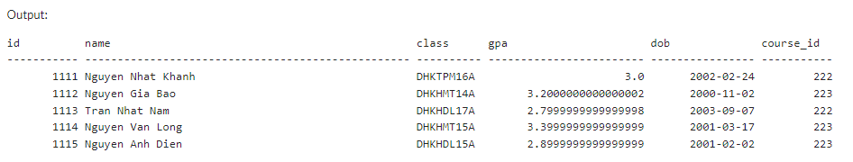
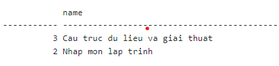
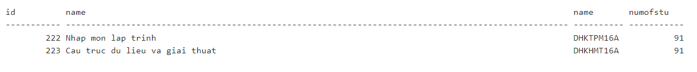
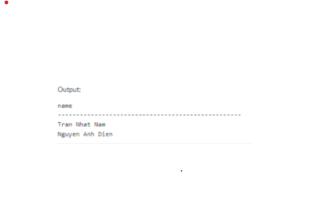

    Trước khi đi vào chủ đề chính thì mình xin phép đi từ phần tổng quan về database trước nhe :D

## I. Giới thiệu

- **Database** dịch ra là cơ sở dữ liệu, nó là một tập hợp có tổ chức các thông tin hoặc dữ liệu có cấu trúc, được kiểm soát bởi Hệ thống Quản lý Cơ sở dữ liệu (Database Management System/DBMS). Ngoài ra các bạn có thể hiểu database tương tự như một file csv/json bình thường vì nó lưu trữ dữ liệu theo một cấu trúc nhất định.
- **SQL vs NoSQL:** Trong thế giới của Database được chia làm hai loại đó chính là SQL và NoSQL, ngoài ra thì mình nghe đồn là có một DBMS bao gồm cả hai loại nhưng mà nó không phổ biến lắm.
  - SQL (Structured Query Language) là ngôn ngữ chuẩn để xử lý Cơ sở dữ liệu quan hệ, một cơ sở dữ liệu quan hệ bao gồm các bảng (table) có mối quan hệ chặt chẽ với nhau.
  - NoSQL (Not only Structured Query Language) là một DMS(Data Management System) trong đó chứa các collection có mối quan hệ không chặt chẽ, dễ dàng mở rộng, được sử dụng để lưu trữ và truy vấn dữ liệu có khối lượng khổng lồ (big data).
- Sự khác nhau giữa SQL và NoSQL:

|                                 | SQL                                           | NoSQL                      |
| ------------------------------- | --------------------------------------------- | -------------------------- |
| Lưu trữ data                    | table                                         | key-value, document, graph |
| Khả năng mở rộng                | theo chiều dọc                                | theo chiều ngang           |
| Phù hợp với môi trường truy vấn | phức tạp                                      | đơn giản                   |
| Hiệu suất                       | nhanh nếu design schema tốt và ngược lại      | nhanh hơn SQL              |
| Ví dụ một số DBMS               | Oracle, PostgreSQL, MS SQL Server, MySQL, ... | MongoDB, Redis, ...        |

=> **Kết luận**: SQL hay NoSQL đều có những tính chất và đặc điểm khác nhau nên không thể đưa ra so sánh cái nào hơn cái nào được và không có cái nào là hoàn hảo để phù hợp cho mọi hệ thống, do đó tùy vào tình hình thực tế và nhu cầu của mỗi bài toán mà chúng ta phải lựa chọn và cân nhắc kĩ.

- Tiếp theo sẽ là câu trả lời cho câu hỏi mà chắc là có nhiều bạn cũng đang hoặc đã từng thắc mắc đó là: "Tại sao có những lúc phải lưu data vào database mà không phải là lưu dưới dạng file như là csv/json?".

  =>**Trả lời:** Do những đặc điểm sau mà nhiều lúc lưu trữ dữ liệu trong database sẽ tối ưu hơn so với file:

  - Cơ sở dữ liệu quan hệ cho phép quản lý và lưu trữ data có mối quan hệ phức tạp dưới dạng các table giúp đảm bảo tính toàn vẹn dữ liệu, ngoài ra còn cung cấp khả năng truy vấn phức tạp, kết hợp nhiều table, ...
  - Lưu vào Database sẽ được tối ưu hóa cho việc truy vấn dữ liệu đồng thời (đa luồng/multi-thread) và mở rộng (Scaling Database)
  - Database cung cấp các công cụ và cơ chế sao lưu và phục hồi dữ liệu mạnh mẽ, giúp bảo vệ dữ liệu khỏi mất mát do những lỗi không mong muốn xảy ra

## II. SQL

### 1. Table

- Bảng (_Table_) là một đối tượng của CSDL được dùng để lưu trữ dữ liệu. Dữ liệu trong bảng được tổ chức thành các hàng (_rows_) và các cột (_columns_). Ở mỗi cột thì sẽ chia ra thành hai phần là tên cột và giá trị trong đó tên cột không được trùng nhau trong một bảng và có thể trùng nhau nếu khác bảng.
- Giống như nhiều ngôn ngữ lập trình thì ở SQL cũng có các kiểu dữ liệu cơ bản là integer, float, nvarchar, date, ...
- Ngoài ra, trong một table còn có khóa chính (_primary key_) để phân biệt các phần tử và khóa ngoại (_foreign key_) để biểu thị mối quan hệ giữa các table.

### 2. Mối quan hệ (_Relationship_)

- Để các bảng liên kết được với nhau thì ở giữa 2 bảng phải có một mối quan hệ, các mối quan hệ trong SQL bao gồm one to one (_1-1_), one to many (_1-n_), và many to many (_n-n_).
- Thông thường, khi truy vấn các trường ở hai table có mối quan hệ n-n thì sẽ tốn nhiều tài nguyên (RAM, CPU, ...). Vì thế, để tối ưu trong trường hợp này thì ta tách hai table có mối quan hệ n-n thành ba table.

**Ví dụ:** Ở một database của một website Thương mại điện tử có hai table là Customer và Product. Vì một khách hàng có thể mua nhiều sản phẩm và một sản phẩm có thể mua bởi nhiều khách hàng nên mối quan hệ giữa hai table này là many to many (n-n). Để tối ưu trong trường hợp này ta sẽ tạo thêm một table là Order chứa hai khóa ngoại của hai bảng Customer và Product.

### 3. Truy vấn trong SQL

### 3.1. Insert into

- Câu lệnh Insert into để chèn thêm một dòng mới vào table
- Cú pháp:
  > INSERT INTO table_name (column1, column2, column3, ...) VALUES (value1, value2, value3, ...);

### 3.2. Update

- Các giá trị của mỗi cột trong table có thể bị thay đổi theo thời gian hoặc do sai sót trong câu lệnh **Insert into**, để sửa những giá trị bị sai đó thì sẽ dùng câu lệnh **Update**
- Cú pháp:
  > UPDATE table_name SET column1 = value1, column2 = value2, ...
  > WHERE condition;
- Một lưu ý nhỏ khi sử dụng câu lệnh **Update** là câu lệnh này chỉ chạy được khi giá trị của cột trong table phải có sẵn, nếu không thì sẽ gặp lỗi.

### 3.3. Delete

- Câu lệnh **Delete** được sử dụng để xóa một hoặc nhiều dòng có sẵn trong một table
- Cú pháp:
  > DELETE FROM table_name WHERE condition;

### 3.4. Select

    Bây giờ các bạn hãy tưởng tượng là đang truy vấn trên database của một website Đăng ký học phần có diagram như ảnh dưới

- Câu lệnh **Select** được dùng để đọc một hoặc nhiều trường trong một table
- Cú pháp:
  > SELECT column1, column2, ... FROM table_name;

**Ví dụ:** select id, name, class from Student

- Ngoài ra, cú pháp để đọc tất cả các trường trong một table là:
  > SELECT \* FROM table_name;

**Ví dụ:** Để lấy ra thông tin của tất cả sinh viên, ta có câu query sau:

        select * from Student

### 3.4.1. Truy vấn đơn

- **Distinct**: Truy vấn loại bỏ các dòng bị trùng. Cú pháp:
  > SELECT DISTINCT column1, column2, ... FROM table_name;
- **Where**: Phía sau **Where** sẽ là một hoặc nhiều câu lệnh điều kiện và có thể áp dụng các toán tử điều kiện là **And**, **Or** hoặc **Not**.

**Ví dụ**: Để trả về các sinh viên có course_id là 223 và có GPA lớn hơn 3, ta chạy câu lệnh sau:

    select * from Student where course_id = 223 and gpa > 3

- **Like**: Phía sau **Like** sẽ là một pattern.

**Ví dụ:** Để lấy ra các sinh viên thuộc ngành KHDL, chạy câu lệnh:

    select * from Student where class like "%KHDL%"

- **Order by**: Dùng trong các câu truy vấn sắp xếp và đứng trước **Anc** (tăng dần) và **Desc** (giảm dần), mặc định sẽ là sắp xếp tăng dần. Cú pháp:
  > SELECT column1, column2, ... FROM table_name
  > ORDER BY column1, column2, ... ASC|DESC;
- **Count**: Trả về số lượng phần tử thỏa mãn điều kiện.

**Ví dụ:** Để lấy số lượng sinh viên có GPA nhỏ hơn 3, khi chạy câu query sau sẽ trả về 2:

    select count(*) from Student where gpa < 3

- **Group by**: được sử dụng để gom nhóm một cột bất kì trong table, thường đứng sau **Where** (nếu có) và đứng trước **Having**.

**Ví dụ:** Để lấy ra số lượng sinh viên của mỗi khóa học, ta chạy câu query:

    select count(Student.course_id), Course.name from Student
    inner join Course on Student.course_id = Course.id
    group by Course.name

- **Having**: như dã viết ở trên thì phía sau **Where** là một hoặc nhiều câu lệnh điều kiện và khi có một câu lệnh điều kiện trong đó một vế là một tập hợp thì phải sử dụng mệnh đề **Having** thay vì dùng **Where**, nếu không thì sẽ gặp lỗi. Cú pháp:
  > SELECT column_name(s) FROM table_name
  > WHERE condition GROUP BY column_name(s)
  > HAVING condition
  > ORDER BY column_name(s);

### 3.4.2. Truy vấn trên nhiều bảng

- Trong câu lệnh **Select** thì sẽ có những trường hợp trả về thông tin thuộc các trường ở hai hay nhiều table, lúc này ta phải sử dụng **Join**

**Ví dụ**: Để xác định các khóa học thuộc lớp nào và sỉ số là bao nhiêu, ta cần truy vấn thông tin ở cả hai bảng là Course và Class. Câu truy vấn sẽ là:

    select Course.id, Course.name, Class.name, Class.numofstu from Course
    inner join Class on Course.class_id = Class.id

- Ngoài ra còn có **Left join**, **Right join**, **Full join** và **Self join** các bạn tham khảo thêm ở trang https://www.w3schools.com
- **Select into**: Tạo ra một bảng mới dựa vào kết quả của câu lệnh **Select**. Cú pháp:

  > SELECT column1, column2, column3, ... INTO newtable [IN externaldb] FROM oldtable
  > WHERE condition;

- **Union**: Được dùng để nối kết quả từ nhiều câu lệnh **Select** khác nhau. Cú pháp:

  > SELECT column_name(s) FROM table1
  > UNION
  > SELECT column_name(s) FROM table2;

### 3.6. Truy vấn con (Nested query)

- **In**: Để so sánh một phần tử với một tập hợp nhiều phần tử. Cú pháp:

  > SELECT \* FROM Customers WHERE CustomerID IN (SELECT CustomerID FROM Orders);

- **Not in**: phủ định của In
- **Any**: Kết hợp với các toán tử so sánh >, >=, <, <= và <>, trả về TRUE nếu thỏa mãn ít nhất một điều kiện trong subquery. Cú pháp:

  > SELECT column_name(s) FROM table_name
  > WHERE column_name operator ANY
  > (SELECT column_name FROM table_name WHERE condition);

**Ví dụ:** Để lấy ra tên các sinh viên thuộc ngành KHDL (dùng truy vấn con), ta có câu query sau:
select name from Student where class = any
(select class from Student where class like "%KHDL%")

- **All**: Kết hợp với các toán tử so sánh >, >=, <, <= và <>, trả về TRUE nếu thỏa mãn tất cả các điều kiện trong subquery. Cú pháp:

  > SELECT column_name(s) FROM table_name
  > WHERE column_name operator ALL
  > (SELECT column_name FROM table_name WHERE condition);

- **Exists**: Được dùng để kiểm tra kết quả của subquery có rỗng hay không, trả về TRUE nếu kết quả của subquery chứa ít nhất một giá trị. Cú pháp:
  SELECT column_name(s) FROM table_name
  WHERE EXISTS
  (SELECT column_name FROM table_name WHERE condition);
- **Not Exists**: Phủ định của Exists
  

_Bài blog về SQL cơ bản của mình đến đây là kết thúc, cảm ơn các bạn đã đọc tới đây nhe_ ><
